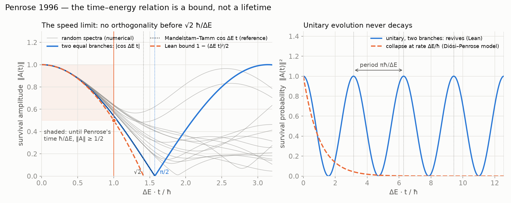

# NRS³ · Penrose

**Penrose's collapse time `ħ / ΔE` is a bound, not a lifetime** — at that time every unitary
evolution still keeps a survival amplitude of at least `cos 1 > 1/2`. Built on Mandelstam–Tamm
(1945), with nothing defined anew. Lean 4.

**[▶ Try it: unitary vs collapse on the Bloch sphere](https://naype888-cloud.github.io/nrs3-penrose/)**



## Results

| Statement | Lean |
|---|---|
| `‖A(t)‖ ≥ 1 − ΔE² t² / 2` for every `t`, as a corollary | `one_sub_le_norm_amplitude` |
| at Penrose's time `ħ/ΔE`: `‖A‖ ≥ cos 1 ≈ 0.54` | `cos_one_le_norm_amplitude` |
| hence `‖A‖ > 1/2`: the state has not decayed | `half_lt_norm_amplitude` |
| no orthogonality before `πħ/(2ΔE)` | `speed_limit` |
| two equal branches: orthogonal exactly at `πħ/(2ΔE)` | `twoBranch_orthogonal` |
| and back to `1` with period `πħ/ΔE`: no decay | `twoBranch_periodic` |

The amplitude, the spread `ΔE` and the bound `cos(ΔE t) ≤ ‖A(t)‖` are those of
[`nrs3-mandelstam-tamm-cramer-rao`](https://github.com/naype888-cloud/nrs3-mandelstam-tamm-cramer-rao),
which this package requires: Penrose's reading is a corollary of Mandelstam–Tamm, not a second
dynamics.

## In NRS³

The time–energy side of NRS³ (`D40`, `D41` in the base repository) bounds how fast a state can
move. Read as a bound, it cannot make a superposition decay at rate `ΔE/ħ`: a gravity-related
collapse needs non-unitary dynamics.

## History

Penrose (1996) estimated the collapse time of a superposition of two mass distributions as
`τ = ħ / ΔE` from the gravitational self-energy of their difference; Diósi (1987) gave a stochastic
dynamics with the same scale. Donadi et al., *Nat. Phys.* 17, 74 (2021), ruled out the
parameter-free Diósi–Penrose model at Gran Sasso. Nothing here tests gravity; it only shows what
unitary quantum mechanics says at `ħ / ΔE`.

## Build

Lean 4 `v4.34.0`, Mathlib `v4.34.0` and `nrs3-mandelstam-tamm-cramer-rao`, nothing else.

```bash
lake exe cache get
lake build
lake env lean Verification/Axioms.lean   # only propext, Classical.choice, Quot.sound
```

Every file: no `sorry`, lines of at most 100 characters, English headers.

## Timeline 1911–1945

NRS answers a question of the Solvay era with later tools. The series is placed in that window:
what falls inside it is the history the theorem belongs to; what falls after it is a proposal,
not part of NRS³.

| Year | Event | Repository |
|---|---|---|
| 1911 | First Solvay conference: radiation and the quanta | |
| 1911–12 | Poincaré: Planck's law forces discrete levels | [`nrs3-poincare`](https://github.com/naype888-cloud/nrs3-poincare) |
| 1915–20 | Szegő: limit theorems for Toeplitz matrices (the limit `C∞`, `D8`) | [base repository (NRS, NRS³)](https://github.com/naype888-cloud/nava-robertson-schrodinger) |
| 1917–27 | Einstein and de Sitter: `Λ` and the empty universe; Friedmann and Lemaître: the expanding universe | [`nrs3-de-sitter`](https://github.com/naype888-cloud/nrs3-de-sitter) |
| 1925–27 | Pauli: exclusion, shells `2n²`, spin matrices | [`nrs3-pauli-dirac`](https://github.com/naype888-cloud/nrs3-pauli-dirac) |
| 1927 | Heisenberg's relation; fifth Solvay conference: electrons and photons | |
| 1928 | Dirac: the `4 × 4` gamma matrices | [`nrs3-pauli-dirac`](https://github.com/naype888-cloud/nrs3-pauli-dirac) |
| 1929 | van der Waerden: spinors, `SL(2, ℂ)` on Hermitian matrices; the uncertainty cone | [`nrs3-uncertainty-cone`](https://github.com/naype888-cloud/nrs3-uncertainty-cone) |
| **1929–30** | **Robertson and Schrödinger: the uncertainty inequality** | **[base repository (NRS, NRS³)](https://github.com/naype888-cloud/nava-robertson-schrodinger)** |
| 1945–46 | Mandelstam–Tamm: the time–energy bound; Rao (1945), Cramér (1946) | [`nrs3-mandelstam-tamm-cramer-rao`](https://github.com/naype888-cloud/nrs3-mandelstam-tamm-cramer-rao) |

**Tools from after the window.** Niven (1956: rational values of the trigonometric functions),
Fiedler (1973: algebraic connectivity), Lean 4 and Mathlib (the verification). The question is
of 1929; the tools are later; the checking is of 2026.

**After the window: proposals, not NRS³.** **[`nrs3-penrose`](https://github.com/naype888-cloud/nrs3-penrose)** (this one) (Penrose 1996, gravity-related
collapse) and [`nrs3-rovelli-lqg`](https://github.com/naype888-cloud/nrs3-rovelli-lqg) (loop quantum gravity, area spectrum 1995). They use NRS³ results
but their physical readings belong to quantum information and quantum gravity.
[`nrs3-defect-curvature`](https://github.com/naype888-cloud/nrs3-defect-curvature) restates base theorems (`D16`–`D16i`); its Bekenstein–Hawking (1973–75) reading
is a declared bridge.

## The mosaic

- [NRS and NRS³ — the base theorem](https://github.com/naype888-cloud/nava-robertson-schrodinger)
- [NRS³ · Mandelstam–Tamm and Cramér–Rao](https://github.com/naype888-cloud/nrs3-mandelstam-tamm-cramer-rao)
- [NRS³ · Landauer and Carnot](https://github.com/naype888-cloud/nrs3-landauer-carnot)
- [NRS³ · de Sitter](https://github.com/naype888-cloud/nrs3-de-sitter)
- **[NRS³ · Penrose](https://github.com/naype888-cloud/nrs3-penrose)** (this one)
- [NRS³ · Pauli–Dirac](https://github.com/naype888-cloud/nrs3-pauli-dirac)
- [NRS³ · The uncertainty cone](https://github.com/naype888-cloud/nrs3-uncertainty-cone)
- [NRS³ · Poincaré](https://github.com/naype888-cloud/nrs3-poincare)
- [NRS³ · Defect and curvature](https://github.com/naype888-cloud/nrs3-defect-curvature)
- [NRS³ · Rovelli — Loop Quantum Gravity](https://github.com/naype888-cloud/nrs3-rovelli-lqg) (proposal)

## License

NRS Noncommercial License 1.0.0, see [`LICENSE`](LICENSE). Author: Eduardo Nava-Hernandez.
